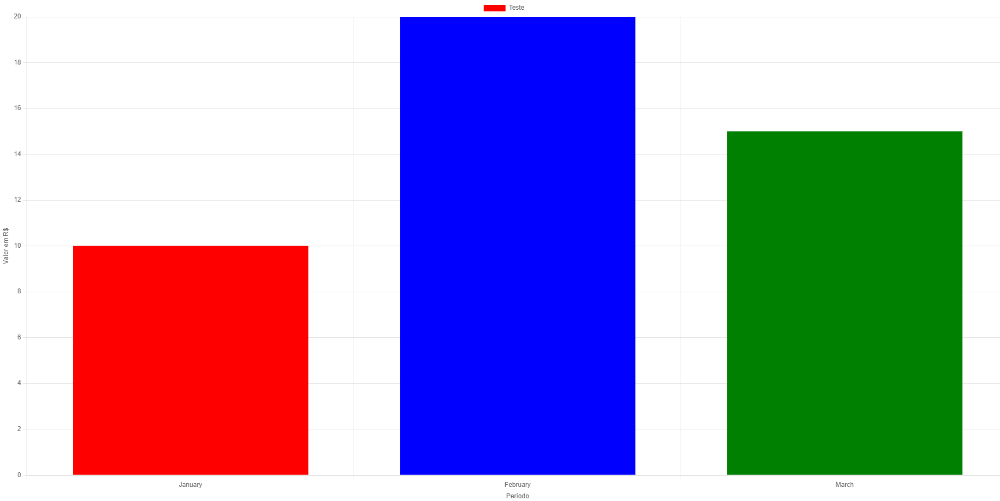
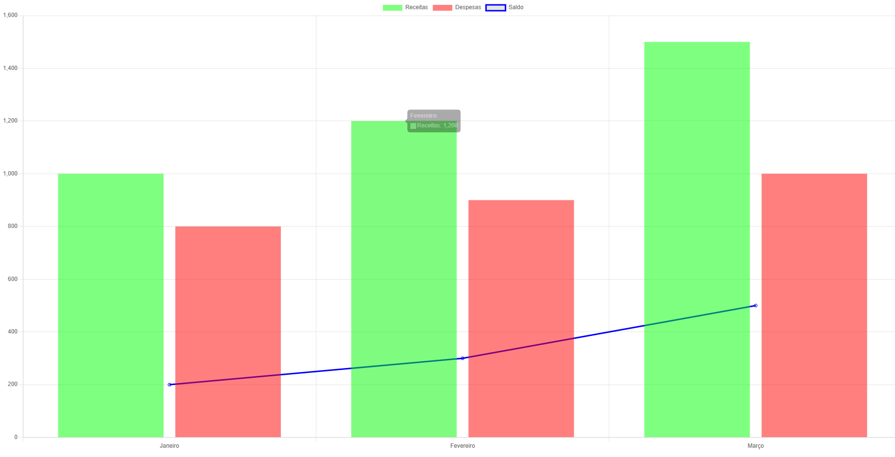
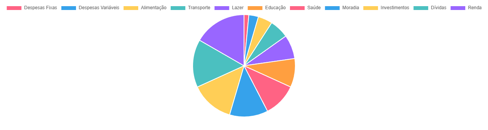
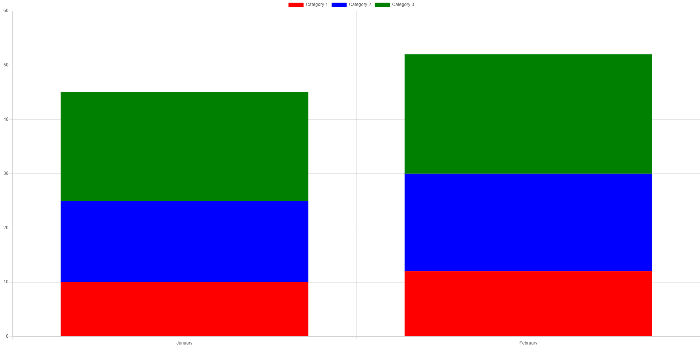

# playing-with-chats.js

Chart.js is a powerful JavaScript library for creating interactive and visually appealing charts. It provides a wide range of chart types, including bar charts, line charts, pie charts, and more. With Chart.js, you can easily display data in a visually appealing and informative way.

## Our Generated Charts

### Bar Chart

[View HTML](./BasicCharts/barChart.html)

### Mixed Chart - Line and Bars

[View HTML](./BasicCharts/barAndLineChart.html)

### Pie Chart

[View HTML](./BasicCharts/pieChart.html)

### Stacked Bar Chart

[View HTML](./BasicCharts/stackedBarChart.html)
